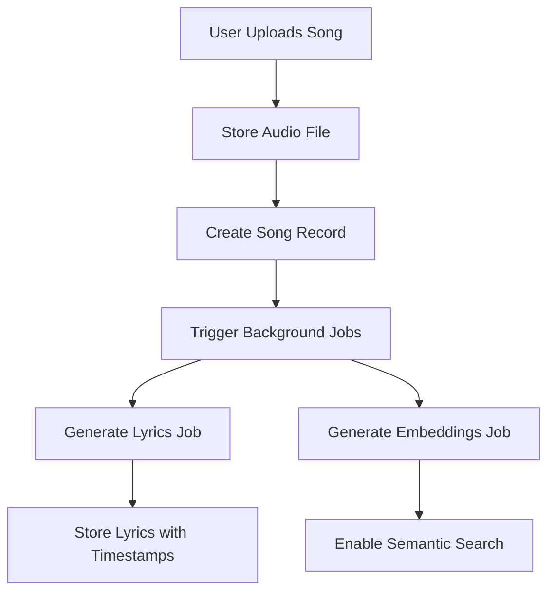

# JuiceVault Architecture Documentation

## Overview

JuiceVault is a Spotify-like platform specifically designed for Juice WRLD fans to upload, manage, and enjoy unreleased songs with automatic lyrics generation and synchronization capabilities.

## Tech Stack

- **Framework**: Next.js 15 with App Router
- **Language**: TypeScript
- **Styling**: Tailwind CSS with shadcn/ui components
- **Database**: PostgreSQL with Prisma ORM
- **State Management**: Effect-TS for functional programming and service architecture
- **API Layer**: tRPC for type-safe APIs
- **Authentication**: NextAuth.js
- **AI Integration**: 
  - Vercel AI SDK for lyrics generation
  - OpenAI GPT-4 for text generation
  - OpenAI Embeddings for semantic search
- **Vector Database**: Upstash Vector for similarity search
- **Background Jobs**: Trigger.dev for long-running tasks
- **File Storage**: (To be implemented - suggested: AWS S3 or Cloudinary)

## Architecture Layers

### 1. Database Layer (Prisma)

The database schema includes:

- **Song**: Core entity storing song metadata, audio URLs, and embeddings
- **Lyrics**: Song lyrics with generation status and verification flags
- **LyricLine**: Individual lyric lines with timestamps for synchronization
- **Playlist**: User-created playlists
- **UserLike**: Track user favorites
- **ProcessingJob**: Background job tracking for async operations

### 2. Domain Layer (Effect Services)

Located in `/src/domain/`, this layer contains business logic organized as Effect services:

#### Song Service (`/src/domain/song/`)
- CRUD operations for songs
- Play count tracking
- Search functionality

#### Lyrics Service (`/src/domain/lyrics/`)
- Lyrics creation and updates
- Line-by-line synchronization
- Verification management

#### AI Services (`/src/domain/ai/`)

##### LyricsAIService
- **generateLyrics**: Creates lyrics using GPT-4 based on song metadata
- **syncLyricsWithTimestamps**: Automatically generates timestamps for lyrics
- **improveTimestamps**: Aligns timestamps with audio beat detection

##### EmbeddingsService
- **generateEmbedding**: Creates vector embeddings for text
- **storeSongEmbedding**: Stores song title embeddings
- **storeLyricsEmbedding**: Stores lyrics embeddings
- **semanticSearch**: Vector similarity search
- **hybridSearch**: Combines semantic and text search

### 3. Background Jobs (Trigger.dev)

Located in `/src/jobs/`, handles long-running operations:

#### generateLyricsJob
1. Generates lyrics using AI
2. Syncs timestamps automatically
3. Saves to database
4. Creates embeddings for search

#### syncLyricsJob
1. Takes user-provided lyrics
2. Generates timestamps
3. Updates database
4. Refreshes embeddings

#### generateEmbeddingsJob
1. Creates title embeddings
2. Creates lyrics embeddings
3. Stores in vector database

### 4. API Layer (tRPC)

Located in `/src/server/api/`, provides type-safe endpoints for:
- Song management
- Lyrics operations
- Search functionality
- Playlist management

## Key Features Implementation

### 1. Song Upload Flow



### 2. Lyrics Generation Pipeline

1. **Input**: Song metadata (title, artist, duration, audio URL)
2. **AI Processing**: GPT-4 generates contextual lyrics
3. **Timestamp Sync**: AI estimates line timings
4. **Storage**: Save lyrics with timestamps
5. **Indexing**: Create searchable embeddings

### 3. Search Architecture

#### Text Search
- Direct database queries using PostgreSQL full-text search
- Searches titles, artist names, and lyrics content

#### Semantic Search
- Converts search query to embedding
- Queries Upstash Vector database
- Returns similar songs based on meaning

#### Hybrid Search
- Combines both approaches
- Ranks results by relevance score
- Provides best of both worlds

### 4. Real-time Lyrics Display

- Synchronized playback using timestamp data
- Line highlighting based on current playback time
- Smooth scrolling animation
- Edit mode for corrections

## Effect-TS Service Pattern

Services follow a consistent pattern:

```typescript
export class ServiceName extends Effect.Service<ServiceName>()("ServiceName", {
  dependencies: [RequiredService],
  effect: Effect.gen(function* () {
    const dependency = yield* RequiredService;
    
    return {
      method: (input) => Effect.pipe(
        // Validation
        Schema.decodeUnknown(InputSchema)(input),
        // Business logic
        Effect.flatMap(processData),
        // Error handling
        Effect.mapError(handleError)
      )
    };
  }),
  accessors: true,
}) {}
```

Benefits:
- Dependency injection
- Type-safe error handling
- Composable operations
- Testability

## Security Considerations

1. **Authentication**: All upload operations require authentication
2. **Authorization**: Users can only modify their own uploads
3. **Input Validation**: Schema validation on all inputs
4. **File Validation**: Audio file type and size checks
5. **Rate Limiting**: API endpoint protection (to be implemented)
6. **Secure Storage**: Signed URLs for media access

## Performance Optimizations

1. **Background Processing**: Heavy operations run asynchronously
2. **Caching**: Query results cached (to be implemented)
3. **CDN**: Static assets and media files (to be implemented)
4. **Database Indexing**: Optimized queries with proper indexes
5. **Lazy Loading**: Components and data loaded on demand

## Development Workflow

1. **Database Changes**: Update Prisma schema → Run migrations
2. **New Features**: Create domain service → Add tRPC endpoint → Build UI
3. **Background Tasks**: Define Trigger.dev job → Handle in service layer
4. **Testing**: Unit tests for services → Integration tests for API

## Environment Variables Required

```env
# Database
DATABASE_URL=

# Authentication
NEXTAUTH_URL=
NEXTAUTH_SECRET=

# AI Services
OPENAI_API_KEY=

# Vector Database
UPSTASH_VECTOR_REST_URL=
UPSTASH_VECTOR_REST_TOKEN=

# Background Jobs
TRIGGER_API_KEY=
TRIGGER_API_URL=

# File Storage (to be configured)
AWS_ACCESS_KEY_ID=
AWS_SECRET_ACCESS_KEY=
AWS_BUCKET_NAME=
```

## Future Enhancements

1. **Audio Analysis**: Beat detection for better timestamp alignment
2. **Collaborative Playlists**: Share and collaborate on playlists
3. **Social Features**: Comments, likes, shares
4. **Mobile App**: React Native implementation
5. **Offline Support**: Download for offline playback
6. **Advanced Search**: Filter by mood, tempo, lyrics themes
7. **AI DJ**: Automatic playlist generation based on preferences